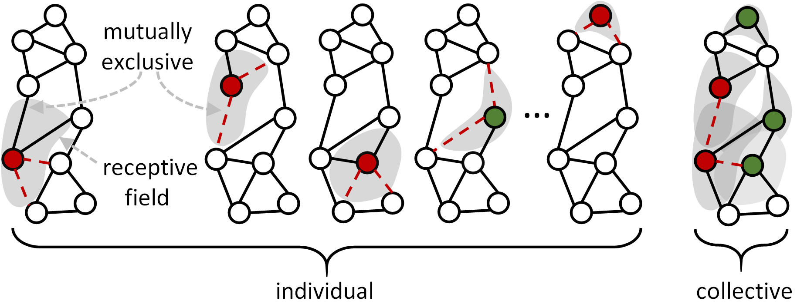

## Collective Robustness Certificates

<p align="center">


Reference implementation of the certificate proposed in

["Collective Robustness Certificates: Exploiting Interdependence in Graph Neural Networks"](https://openreview.net/forum?id=ULQdiUTHe3y)  
Jan Schuchardt, Aleksandar Bojchevski, Johannes Gasteiger, and Stephan Günnemann, ICLR 2021.

## Usage
To use the certificate you need to provide the following data:
* A binary attributed graph consisting of an attribute and an adjacency matrix.
* A boolean array corresponding to prediction-wise base certificates where
  * Each element of the first dimension corresponds to a different prediction / node, 
  * The *d* trailing dimensions correspond to different perturbation types.
* A list of *d* strings from {adj_del, attr_add, attr_del}, indicating which of the trailing dimensions corresponds to which perturbation type  .
* A list of *d* binary sparse matrices characterizing each prediction's receptive field.  
  * Shape (n, n) for attribute perturbations.  
  * Shape (n, |E|) for edge deletions, where |E| is number of existing edges.  

The notebook demo.ipynb provides an usage example with pre-calculated base certificates based on randomized smoothing.  
Our method works with any cvxpy-compatible optimizer, but we recommend using a commercial solver (e.g. MOSEK or GUROBI) for improved efficiency.

## Cite
Please cite our paper if you use this code in your own work:

```
@InProceedings{Schuchardt2021_Collective,
  author = {Schuchardt, Jan and Gasteiger, Johannes and Bojchevski, Aleksandar and G{\"u}nnemann, Stephan},
  title     = {Collective Robustness Certificates: Exploiting Interdependence in Graph Neural Networks},
  booktitle = {International Conference on Learning Representations},
  year      = {2021},
}
```
